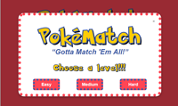
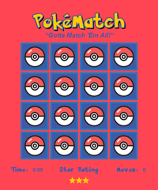
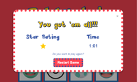

# PokéMatch Concentration Game

## Project Purpose:

This game was built as a Udacity Course project. The purpose of the project is to demonstrate mastery of HTML, CSS, and JavaScript.

## How to Load the game

- Clone the **[repo](https://github.com/sarah-maris/memory-game.git)** and open index.html -- or --
- Play on GitHub.io: **[PokéMatch Concentration Game](https://sarah-maris.github.io/memory-game/)**

### How to Play the Game

The game board consists of twelve to twenty-four cards arranged randomly in a grid. The deck is made up of six to twelve pairs of cards, each with different symbols on one side.

At start player chooses a level:

- "easy" has 6 pairs of cards
- "medium" has 8 pairs of cards
- "hard" has 12 pairs of cards

On each turn:

- The player flips one card over to reveal its underlying symbol
- The player then turns over a second card, trying to find the corresponding card with the same symbol
- If the cards match, both cards stay flipped over
- If the cards do not match, both cards are returned to their initial hidden state
- The game ends once all cards have been correctly matched.

### Screenshots

 

### Special Features

- Player can choose between "easy", "medium" and "hard" mode
- The game features a timer to keep track of how long it takes to win
- The player starts out with a three star rating -- but the rating drops the more moves it take to complete the game
- When the game ends, a pop-up appears with the elapsed time, final star rating and a restart button

## Resources used to create the game:

### Array shuffle:

- <http://stackoverflow.com/questions/2450954/how-to-randomize-shuffle-a-javascript-array>

### Card Flipping CSS:

- <https://davidwalsh.name/css-flip>
- <http://callmenick.com/post/css-transitions-transforms-animations-flipping-card>

### Timer

- <https://www.w3schools.com/howto/howto_js_countdown.asp>

### Modal

- <https://www.w3schools.com/howto/howto_css_modals.asp>

### Button CSS

- <http://css3buttongenerator.com/>

### Pokémon Font

- <http://fontmeme.com/fonts/pokmon-font/>

### Pokémon Images:

- <https://www.vecteezy.com/vector-art/117920-pokemon-ball-vector>
- <https://www.vecteezy.com/vector-art/117861-free-pokemon-vector>

### Pokémon Colors

- <http://brandware.io/brand/98/colors>

COLOR                   | HEX     | RGB
----------------------- | ------- | ------------
Pokémon Yellow          | #ffcb05 | 255, 203, 5
Pokémon Blue            | #0071b9 | 0, 113, 185
Pokémon Yellow Shadow   | #c7a008 | 199, 160, 8
Pokémon Logo Light Blue | #2a75bb | 42, 117, 187
Pokémon Logo Dark Blue  | #3c5aa6 | 60, 90, 166
Red                     | #e60012 | 230, 0, 18
Coral Red               | #FF4554 | 255, 69, 84

#### Udacity Resources:

- [Project Description](https://classroom.udacity.com/nanodegrees/nd016beta/parts/45080fba-9129-4bd9-869f-548be080accf/modules/677caa06-55d6-444e-a853-08627c5516a7/lessons/4227cbf4-f6ce-4798-a7e5-b1ce3b9e7c33/concepts/0a38769e-8e23-4e3f-9482-d8d1aa80fbb6)
- [Project Rubric](https://review.udacity.com/#!/rubrics/591/view)
